# A Framework for Sensorimotor Cross-Perception and Cross-Behavior Knowledge Transfer for Object Categorization

**Abstract:**

> From an early stage in development, human infants learn to use exploratory behaviors to learn about the objects around them. Such exploration provides observations of how objects feel, sound, look, and move as a result of actions applied on them. Research in robotics has shown that robots too can use such behaviors (e.g., grasping, pushing, shaking) to infer object properties that cannot always be detected using visual input alone. Such learned representations are specific to each individual robot and cannot currently be transferred directly to another robot with different sensors and actions. Moreover, sensor failure can cause a robot to lose a specific sensory modality which may prevent it from using perceptual models that require it as input. To address these limitations, we propose a framework for knowledge transfer across behaviors and sensory modalities such that: 1) knowledge can be transferred from one or more robots to another, and, 2) knowledge can be transferred from one or more sensory modalities to another. We propose two different models for transfer based on variational auto-encoders and encoder-decoder networks. The intuition behind our approach is that if robots interact with a shared set of objects, the produced sensory data can be used to learn a mapping between multiple different feature spaces, each corresponding to a particular behavior coupled with a sensory modality. We evaluate our approach on a category recognition task using a dataset containing 9 robot behaviors, coupled with 4 sensory modalities, performed multiple times on a set of 100 objects. The results show that sensorimotor knowledge about objects can be transferred both across behaviors and across sensory modalities, such that a new robot (or the same robot, but with a different set of sensors) can bootstrap its category recognition models without having to exhaustively explore the full set of objects.

## Development Environment
For our research, we used Tufts High Performance Computing (HPC) that has NVIDIA Tesla P100 (16GB, 3584 CUDA Cores).
The neural networks were implemented in widely used deep learning framework `TensorFlow 1.12` with GPU support (CUDA 10.2).

## Dependencies

`Python 3.5.6` is used for development and following packages are required to run the code:  
`pip install tensorflow-gpu==1.12.0` 
`pip install sklearn==0.20.0` 
`pip install matplotlib==3.0.0` 
`pip install numpy==1.15.3`

## [Dataset](Datasets)

- [Visualization of each modalities](DatasetVisualization.ipynb)

## How to run the code?

### One Source Robot:

Run: `python 1_source_b-ved_b-vae.py [mapping]`

Mapping: A2A, A2H, A2S, A2V, H2A, H2H, H2S, H2V, S2A, S2H, S2S, S2V, V2A, V2H, V2S, V2V  
Example: `python 1_source_b-ved_b-vae.py H2H`

### Two Source Robots:

Run: `python 2_sources_b-vae.py [mapping]`

Mapping: AS2H, AS2V, HH2H, HV2S  
Example: `python 2_sources_b-vae.py HH2H`

## Experiment Pipeline 

- The source robot interacts with all the 20 categories (highlighted in solid red line), but the target robot interacts with only 15 categories (highlighted in solid blue line).

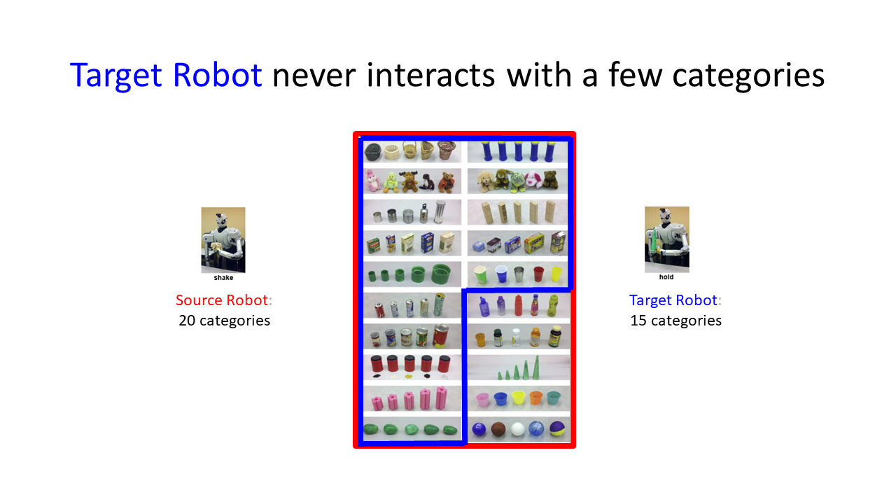

- The objects of 15 categories shared by both the robots are used to train the encoder-decoder network that learns to project the sensory signal of the source robot to the target robot.

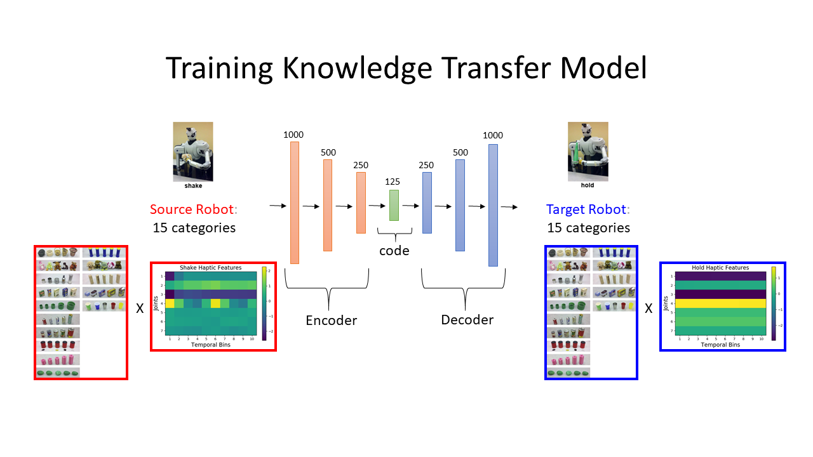

- Subsequently, the trained encoder-decoder network is used to generate “reconstructed” sensory signals for the other 5 object categories (highlighted in dashed blue line) that the target robot did not interact with by projecting the sensory signal of the source robot.

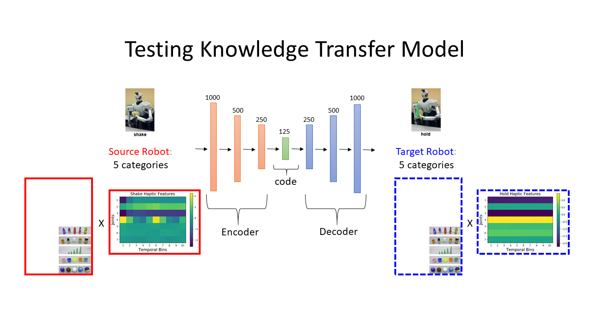

- Once the features are projected, an category recognition classifier is trained using the projected
data from the source context (i.e., how well it would do if it transfered knowledge from the source robot).

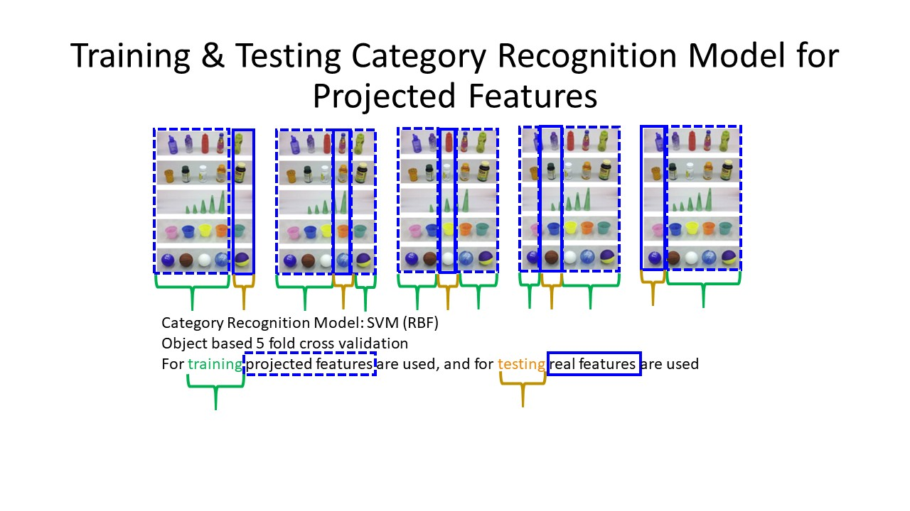

- Additional category recognition classifier is trained using the ground truth data produced by the target robot (i.e., the best the target robot could do if it had explored all the objects) for comparison.

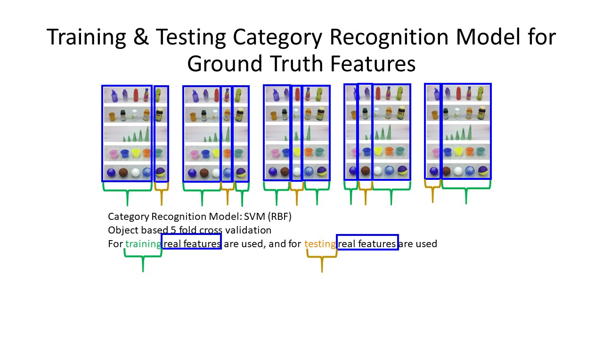

## Results

## Cross-Perception Sensorimotor Transfer

### Accuracy Results of Category Recognition

#### 1 Source Robot:
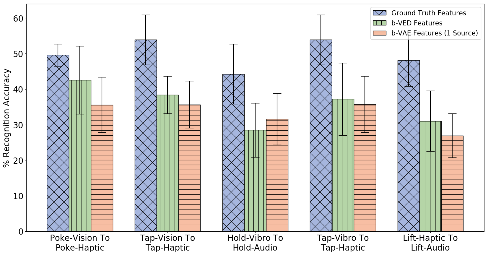

#### 2 Source Robots:
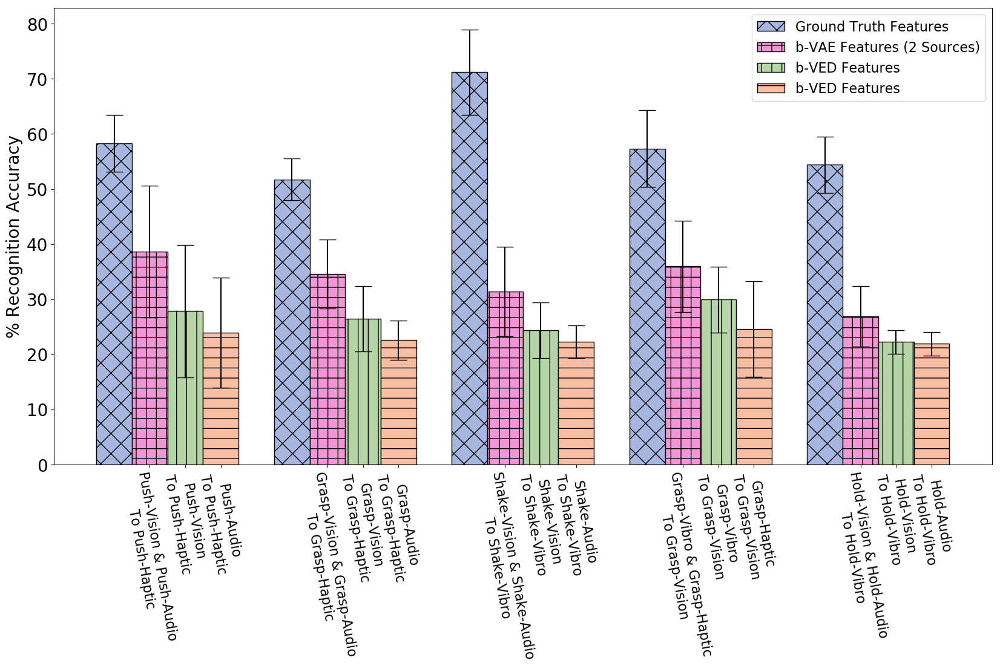

### Accuracy Delta

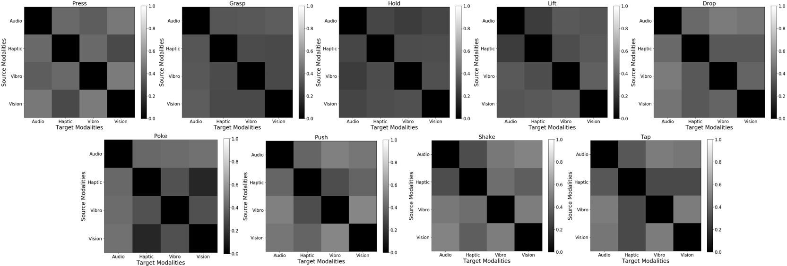

## Cross-Behavioral Sensorimotor Transfer

### Accuracy Results of Category Recognition

#### 1 Source Robot:
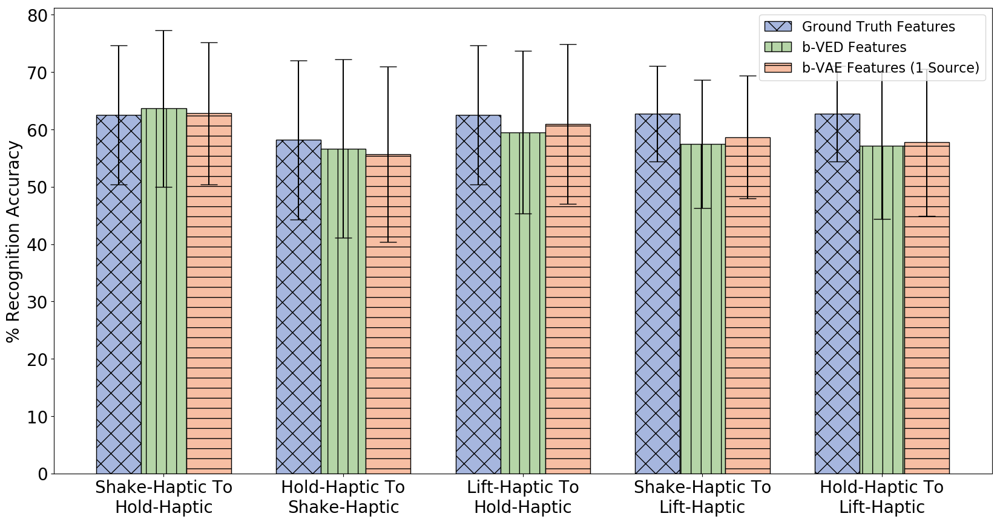

#### 2 Source Robots:
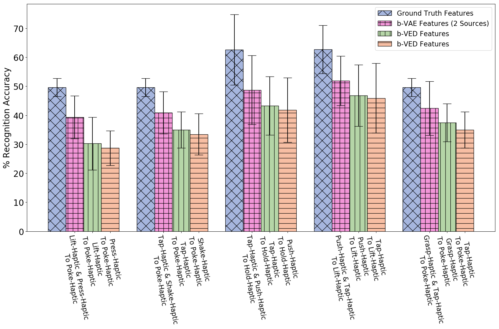

### Accuracy Delta

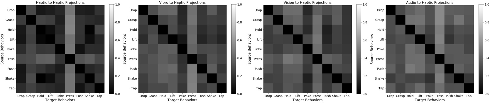

